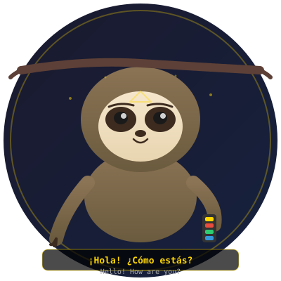
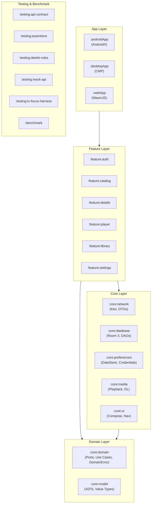

# SubSloth

[](https://developer.android.com/about/versions/14)
[](https://kotlinlang.org)
[](https://www.jetbrains.com/compose-multiplatform/)
[](https://nixos.org)



**Learn languages by watching.** SubSloth is a native multi-platform streaming
client for the [Media](https://media-mirror.tv) Kodi-compatible API. It brings
dual-subtitle video immersion to Android TV, tablets, phones, desktop Linux,
and the browser.

Built with a Functional Core / Imperative Shell architecture, Compose
Multiplatform, and a reproducible Nix development environment — the project is
as much a demonstration of modern Android and KMP engineering as it is a
functional streaming app.

## Design principles

- **Keep the core pure.** Domain logic, types, and transformations live in
  zero-dependency functional modules. I/O, state, and platform APIs are pushed
  to the outermost shell — tested through integration tests, not mocks.
- **Model the domain with sealed types.** Every variant is explicit, every
  `when` is exhaustive, every invalid state is unrepresentable. No boolean
  flags where a sealed interface tells the full story.
- **One module, one responsibility.** Twenty-two modules with a strict inward
  dependency gradient. Features share nothing but core types; the dependency
  graph is acyclic by convention.
- **Test through contracts, not implementations.** API fixtures are captured
  from the live service, sanitised, and replayed through Ktor MockEngine.
  Architecture boundary tests scan import lines — no ArchUnit needed.
- **Reproduce the environment.** Nix pins the JDK (25 for Gradle, 17 for
  bytecode), the Android SDK, Node.js, Yarn, Binaryen, and even Android Studio.
  A single `direnv allow` is the entire setup.

The [canonical architecture specification](openspec/specs/architecture/spec.md)
records the decisions and trade-offs behind these rules.

## Quick start

You need Nix with the `nix-command` and `flakes` experimental features.

```bash
git clone https://github.com/knirski/subsloth.git
cd subsloth
direnv allow

# Safe, local inspection
./gradlew build

# Run on a connected device or emulator
./gradlew installDebug
```

The development shell provides everything: JDK 25 and 17, Android SDK 36 with
command-line tools, sdkmanager, adb, Android Studio, vacuum (OpenAPI linter),
and emulator helper scripts.

See [`docs/development.md`](docs/development.md) for detailed setup and
[`docs/jdk.md`](docs/jdk.md) for JDK toolchain notes.

## Find your path

- **Learn:** start with the [OpenSpec planning overview](openspec/README.md),
  then read the [canonical specs](openspec/specs/) that define every v1
  requirement.
- **Build:** follow the [module structure guide](docs/module-structure.md) to
  understand the 22-module dependency graph, then the [convention plugins
  reference](docs/convention-plugins.md) for Gradle conventions.
- **Code:** read the [codestyle](docs/codestyle.md), the
  [FC/IS architecture](docs/agent/fc-is-architecture.md), and the
  [best-practices quick reference](best_practices.md).
- **Test:** run [offline unit tests](docs/development.md#running-tests),
  [emulator instrumented tests](docs/agent/emulator-testing.md),
  [screenshot tests](docs/testing/screenshot-tests.md), or
  [macrobenchmarks](docs/testing/benchmarks.md).
- **Navigate:** understand [Navigation3 across all platforms](docs/navigation3.md).
- **Contribute:** read [`AGENTS.md`](AGENTS.md) before editing — it contains
  the hard invariants, commit conventions, and verification workflow.

The complete, progressively organized index is at
[`docs/agent/README.md`](docs/agent/README.md).

## Architecture in one minute



**Data flows inward and outward through pure mappers.** The shell layer
(`network`, `database`, `preferences`, `media`) implements port interfaces
defined in `domain`, fetches and persists data, and maps DTOs to domain types
in isolated mapper boundaries. The feature modules consume only domain types
and compose UI from them.

The [full module map](docs/module-structure.md) documents every module's
convention plugin, dependencies, targets, and responsibilities. The
[convention plugins](docs/convention-plugins.md) explain each Gradle
convention's exact configuration.

## Features

| Capability | Details |
|---|---|
| **Dual-subtitle playback** | Watch with two simultaneous subtitle tracks for language immersion |
| **Catalog browsing** | Movies and series with search, filters, and sort |
| **Detail views** | Movie and series detail screens with episode structure and metadata |
| **Video player** | Playback with quality selection, resume, speed control, and subtitle picker |
| **Offline downloads** | Queue management, storage safety, and offline playback |
| **Library & settings** | Personal library, central Downloads screen, settings, diagnostics |

Comments, Chromecast, external player handoff, Play Store billing, and
multi-profile switching are explicitly out of scope for v1. See the
[scope exclusions](docs/policies/scope-exclusions.md).

## Platform support

| Target | Status | Notes |
|---|---|---|
| Android (phone, tablet, TV) | ✅ Production | API 26+, adaptive layouts, TV D-pad focus |
| Desktop (Linux, macOS, Windows) | ✅ Production | CMP desktop app via `:desktopApp` |
| Web (WasmJS) | ✅ Production | Browser build via `:webApp` with OPFS-backed SQLite |
| iOS | 🔜 Future | KMP targets declared but disabled — no CI infrastructure |

## Scope

This project is a native client for the Media Kodi-compatible API, built as a
demonstration of modern Android, Kotlin Multiplatform, and Compose engineering.
Its modules, tests, and patterns are intended to be reusable; the API contract,
fixtures, and credentials handling are specific to the Media service and must
be adapted before use elsewhere.

Shared as a learning project. Contributions should favour clarity, type safety,
and declarative recovery over cleverness.

## License

Apache 2.0 — see [LICENSE](LICENSE).
